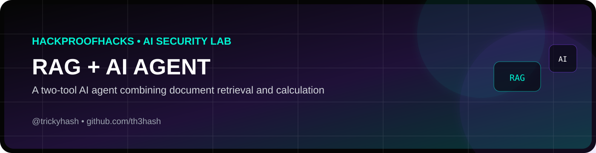
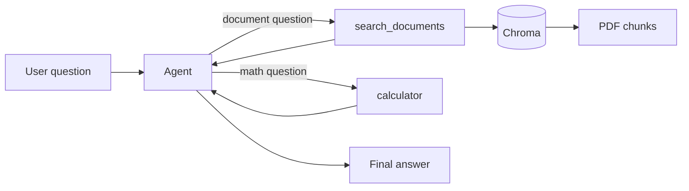
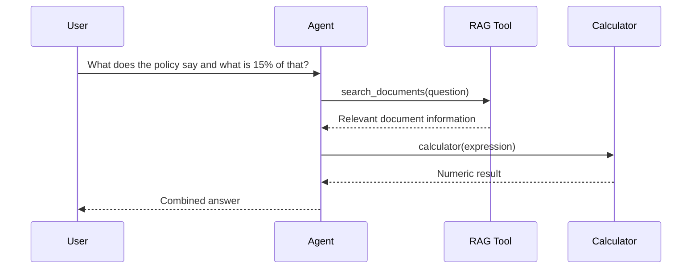
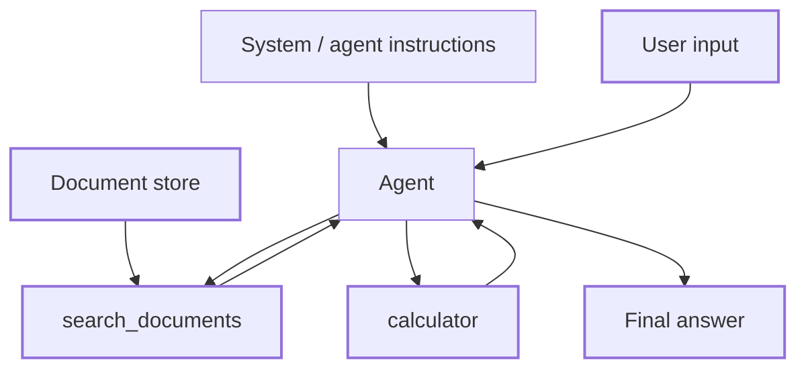

<p align="center"></p>

# RAG + Agent — Two-Tool Local AI Target

A local AI agent that combines the two halves of the Module 6 checkpoint:

- **`search_documents`** — searches a PDF using the RAG pipeline.
- **`calculator`** — performs a mathematical calculation.

The agent chooses the appropriate tool and can chain both tools for a question that requires document retrieval followed by calculation.

> **Safety:** This is a local educational project. Keep the tools restricted to your own machine and use only documents you are authorized to process.

## Architecture



### Two-tool chaining



## Project goal

This repository demonstrates the Module 6 checkpoint:

```text
Module 4 RAG
      +
Module 5 Agent
      ↓
One agent with two tools
```

The checkpoint asks the agent to choose between the tools on at least three questions and demonstrate one question that requires both tools in sequence.

## Requirements

- Python 3.10+
- Ollama
- A local Ollama chat model
- A PDF you own or are authorized to process

## 1. Clone

```bash
git clone https://github.com/YOUR_USERNAME/rag-agent-target.git
cd rag-agent-target
```

## 2. Create a virtual environment

### Windows PowerShell

```powershell
python -m venv venv
.\venv\Scripts\Activate.ps1
```

### macOS / Linux

```bash
python3 -m venv venv
source venv/bin/activate
```

## 3. Install dependencies

```bash
pip install -r requirements.txt
```

## 4. Verify Ollama

```bash
ollama --version
ollama list
```

If required, install a model:

```bash
ollama pull llama3.2
```

Set the model name in `app.py` if you use something else.

## 5. Add your PDF

Put your authorized PDF in the project root:

```text
handbook.pdf
```

## 6. Run

```bash
python app.py
```

The application will build the local vector store and start the agent.

## 7. Assignment test plan

### Test 1 — document-only

Ask a question whose answer exists in the PDF:

```text
What does the document say about [known topic]?
```

Expected tool:

```text
search_documents
```

### Test 2 — math-only

```text
What is 847 * 12?
```

Expected tool:

```text
calculator
```

Expected result:

```text
10164
```

### Test 3 — both tools

Create a question based on a number or fact that actually exists in your PDF.

Example:

```text
What is the maximum refund amount in the policy, and what is 15% of that amount?
```

The agent should:

```text
search_documents
        ↓
retrieve the relevant fact
        ↓
calculator
        ↓
return the combined answer
```

Capture the terminal trace for this test.

## Important calculator note

The original teaching example uses `eval()` for a simple local calculator. This project intentionally uses a restricted AST-based evaluator instead. It supports arithmetic while preventing arbitrary Python execution.

## Project structure

```text
rag-agent-target/
├── app.py
├── requirements.txt
├── README.md
├── attack-surface.md
├── .gitignore
├── LICENSE
├── handbook.pdf              # your authorized document
└── chroma_db/                # generated locally; ignored by Git
```

## Attack surface



| Pipeline stage | What lives here | Phase 3 area |
|---|---|---|
| System prompt | Agent rules | System prompt leakage |
| Document store | Ingest, chunk, embed, store | Data / RAG poisoning |
| User question | Raw text | Injection, jailbreaks, filter evasion |
| Tool calls | `search_documents`, `calculator` | Excessive agency |
| Tool results | Returned observations | Indirect injection via tool output |
| Final answer | Output shown to user | Sensitive information disclosure |

## Portfolio notes

A strong demo should show:

1. The document-only question selecting `search_documents`.
2. The math-only question selecting `calculator`.
3. The combined question calling both tools.
4. The full tool trace.
5. The architecture diagram.
6. The attack-surface table.

## License

MIT — see `LICENSE`.


## 👨‍💻 Built by Hassan Ansari

**Hassan Ansari — @trickyhash**

I build practical cybersecurity and AI-security projects focused on ethical hacking, automation, and hands-on learning.

- 📸 Instagram: **[@trickyhash](https://instagram.com/trickyhash)**
- 💻 GitHub: **[@th3hash](https://github.com/th3hash)**
- 🌐 HackproofHacks: **[hackproofhacks.com](https://hackproofhacks.com)**

> If you found this project useful, feel free to ⭐ the repository and follow the build journey.

